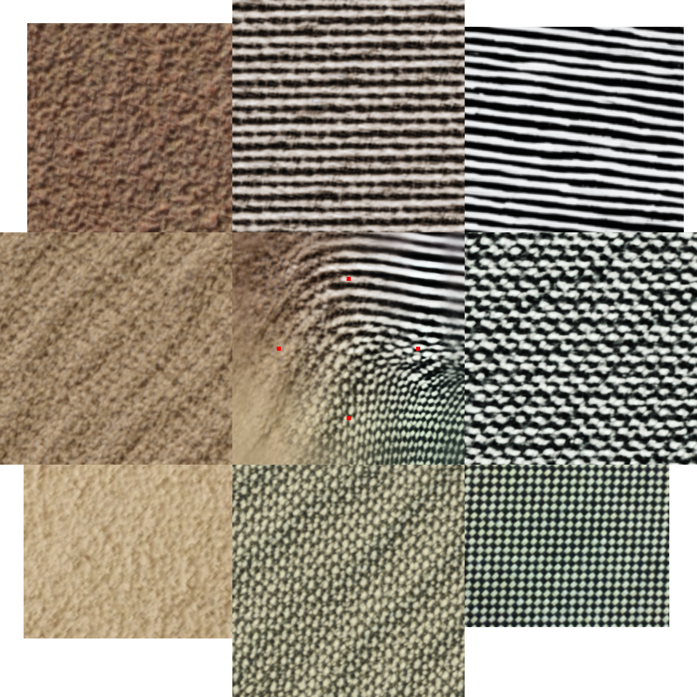

# A geometrically aware auto-encoder for multi-texture synthesis
[Pierrick Chatillon](https://scholar.google.com/citations?user=8MgK55oAAAAJ&hl=en) | [Yann Gousseau](https://perso.telecom-paristech.fr/gousseau/) | [Sidonie Lefebvre](https://www.researchgate.net/profile/Sidonie-Lefebvre)


[Arxiv](https://arxiv.org/pdf/2302.01616.pdf) 

### Official pytorch implementation of the paper: "A geometrically aware auto-encoder for multi-texture synthesis"
Our method allows texture expansion (2*2 bigger than training resolution here) as well as spatial interpolation and smooth temporal interpolation.


### Citation
If you use this code for your research, please cite our paper:

```
@misc{https://doi.org/10.48550/arxiv.2302.01616,
  doi = {10.48550/ARXIV.2302.01616},
  url = {https://arxiv.org/abs/2302.01616},
  author = {Chatillon, Pierrick and Gousseau, Yann and Lefebvre, Sidonie},
  keywords = {Computer Vision and Pattern Recognition (cs.CV), Artificial Intelligence (cs.AI), FOS: Computer and information sciences, FOS: Computer and information sciences},
  title = {A geometrically aware auto-encoder for multi-texture synthesis},
  publisher = {arXiv},
  year = {2023},
  copyright = {arXiv.org perpetual, non-exclusive license}
}
```


### Installation

The 'Macro500' dataset provided by the authors of [Towards Universal Texture Synthesis by Combining Spatial Noise Injection with Texton Broacasting in StyleGAN-2](https://github.com/JueLin/textureSynthesis-stylegan2-pytorch) can be downloaded [here](https://drive.google.com/file/d/15tM8vlc-ZnYVQpyjf63QyQQ9inqtijmt/view?usp=sharing).

These commands will create a conda environment called TextureAE with the required dependencies, then place you in it :
```
conda env create -f requirements.yml
conda activate TextureAE
```

Download and unzip the weights for the VGG19 network from [Gatys et. al.](https://arxiv.org/abs/1505.07376) by running the following command:

```
bash get_vgg_weights.sh
```

Alternatively you can download them directly from [here](https://drive.google.com/file/d/1tdfMcwSogBfAkMcLVJd9z_frsEg8fxAB/view?usp=sharing) and unzip in the main directory.

### Pretrained models


Download and unzip the a pretrained model by running the following command:

```
bash get_pretrained_model.sh
```

Alternatively you can download them directly from [here](https://drive.google.com/file/d/1RcWQTtgPbHr4I0_OPMPXJ0XD8KYfToB3/view?usp=sharing) and unzip in the ./runs/ directory.


###  Train


```
python code/train.py --name <name_of_the_experiment> \
--dataset_folder <path_to_dataset> #<path_to_dataset> should be an absolute path
```


Please refer to code/config.py for described additional arguments such as the latent space dimension --nc_w.
All the models, arguments and tensorboard logs for an experiments are stored under the same folder ./runs/name_of_the_experiment/

### Inference


```
python code/inference.py --name <name_of_the_experiment> 
```

This will fill the folder ./runs/name_of_the_experiment/inference/ with inference results
Additional parameters are:
--text   is a string that will be used as guide to perform spacial editing.
--n_gif  denotes the lenght of gifs animations.

### Results 
Texture Palette: Four input textures of various sizes  and aspect ratio are displayed in the corners. In the center, an image shows a field obtained by performing spatial interpolation between the corner textures. On this field, the red dots are positions from which the images in the middle of each side are synthesized.



This animation shows the synthesis result for a smoothly moving texture descriptor $w$ in latent space. The spatial noise ralization is fixed.


### Acknowledgments
This work was co-financed by ONERA and the [Defence Innovation Agency](https://www.defense.gouv.fr/aid)
Although recoded the architecture of our generator comes from [StyleGAN](https://arxiv.org/abs/1812.04948), the AdaIN code was derived from (https://github.com/CellEight/Pytorch-Adaptive-Instance-Normalization), and the code for the implementation of Gatys et. al. 's texture loss was adapted from (https://storimaging.github.io/notebooksImageGeneration/).

### License
This work is under the CC-BY-NC-4.0 license.

### Disclaimer
The code is provided "as is" with ABSOLUTELY NO WARRANTY expressed or implied.